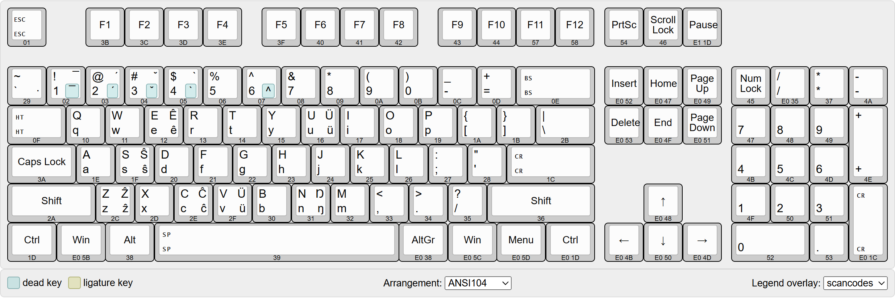
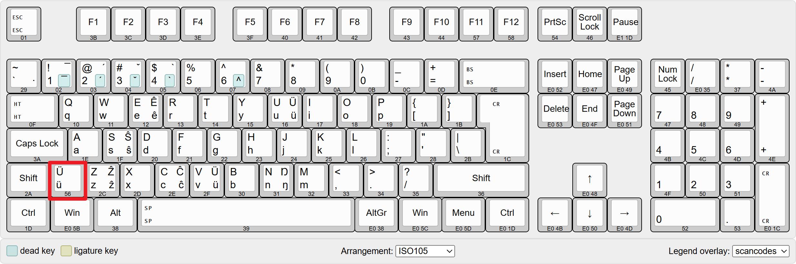

# hanyu-pinyin-keyboard-layout
# Chinese Hanyu Pinyin Keyboard Layout / 汉语拼音键盘布局

The project is a keyboard layout driver to support Chinese Hanyu Pinyin. This keyboard layout is defined as following pictures.

本项目是汉语拼音键盘布局驱动程序，按键如下图定义。

Because most of the Chinese use the United States Keyboard Layout with the ANSI 104 arrangement, this Hanyu Pinyin Keyboard Layout is 100% compatible with the United States Keyboard Layout, which means that all the characters on the United States Keyboard Layout are typed exactly the same way.

因为绝大部分中国人使用美式键盘布局，所以该汉语拼音键盘布局特意设计成100%向下兼容美式键盘，也就是说所有存在美式键盘上的字符，打法保持不变。

The Hanyu Pinyin letters that do not exist in the United States Keyboard Layout are typed via the `AltGr` key (a.k.a. right `Alt` key). For example, the letter `ü` is typed via pressing `AltGr` + `v`, while the capital letter `Ü` is typed via pressing `AltGr` + `Shift` + `v`.

汉语拼音比美式键盘多出来的字符，一律使用 `AltGr` 键（即右边的`Alt`键）组合输入。例如输入 `ü` 就是 `AltGr` + `v`，大写的 `Ü` 则是 `AltGr` + `Shift` + `v` 。

Pressing `AltGr` with `1`, `2`, `3`, `4` types the [dead keys](## "A dead key is a special kind of modifier key on a mechanical typewriter, or computer keyboard, that is typically used to attach a specific diacritic to a base letter. The dead key does not generate a complete character by itself, but modifies the character generated by the key struck immediately after. Thus, a dedicated key is not needed for each possible combination of a diacritic and a letter, but rather only one dead key for each diacritic is needed, in addition to the normal base letter keys.") for the four tones. For example, `ā` is typed via pressing `AltGr`+`1` and then pressing `a`.

按`AltGr`（即右`Alt`键）再加上`1`、`2`、`3`、`4` 组合键，则输入汉语拼音声调的[死键](## "死键是键盘上的一种特殊的快捷键。它们通常用来对原始的拉丁字母加上附加符号。死键并不会输出一个完整的字母，而是改变下一个按下的键的输出结果。因此不需要为每一个字母与每一个标音的组合都对应一个单独的键；只要为每一个标音对应一个死键便足够。")。比如你要输入`ā`，那么按下`AltGr`+`1`，然后松开所有按键，然后再按一下`a`键。

**Bonus:** If you have a keyboard from Europe (i.e. ISO 105 keyboard), then the scancode `56` key is for typing the Pinyin letter `ü` directly, without combination keys at all.

**附加功能：** 如果你有欧洲的键盘（ISO 105键盘），那么比美式键盘多出来的56号按键可以直接打出汉语拼音字符`ü`，无需组合键。

